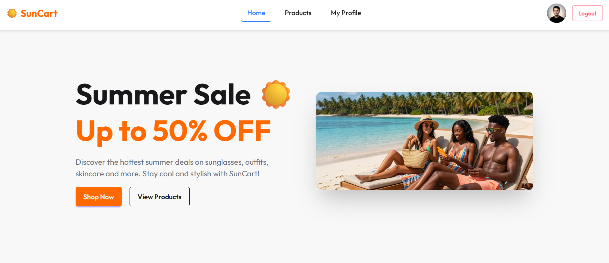

# ☀️ SunCart – Summer Essentials Store

## 🌐 Live Site

👉 https://suncart-two.vercel.app

## 📦 GitHub Repository

👉 https://github.com/arafaths/assignment-08-B13

---

## 🧠 Project Overview

**SunCart** হলো একটি modern summer eCommerce web application যেখানে userরা বিভিন্ন summer related product যেমন sunglasses, outfits, skincare, beach accessories ইত্যাদি browse করতে পারে এবং authentication এর মাধ্যমে product details দেখতে ও purchase করতে পারে।

---

## ✨ Key Features

* 🔐 User Authentication (Email & Google Login)
* 🛍️ Product Listing (Static JSON Data)
* 📄 Product Details Page (Protected Route)
* 👤 User Profile Page
* ✏️ Profile Update Feature (Name & Image)
* 🎨 Modern UI (Tailwind + DaisyUI/HeroUI)
* 📱 Fully Responsive (Mobile, Tablet, Desktop)
* 🎥 Lottie Animation Integration
* 🔄 Redirect after Login (Protected Route System)

---

## 🧩 Pages & Sections

### 🏠 Home Page

* Hero Section (Summer Sale Banner)
* Popular Products (Top 3 items)
* Summer Care Tips
* Top Brands Section

### 🛒 Products Page

* All products list from JSON

### 🔍 Product Details (Protected)

* শুধুমাত্র logged-in user access করতে পারবে
* Login না থাকলে redirect হবে

### 🔐 Authentication

* Login Page (Email + Google)
* Register Page
* Error handling & validation

### 👤 Profile Page

* User info (name, email, image)
* Update Profile option

---

## 🛠️ Tech Stack

* ⚛️ Next.js (App Router)
* 🎨 Tailwind CSS
* 🌼 DaisyUI / HeroUI
* 🔐 BetterAuth
* 🎥 Lottie React
* 🗄️ MongoDB

---

## 📁 Project Structure (Simplified)

```
app/
 ├── page.jsx (Home)
 ├── products/
 ├── profile/
 ├── signin/
 ├── signup/

components/
 ├── Navbar.jsx
 ├── ProductCard.jsx
 ├── PopularProducts.jsx

data/
 ├── products.json
```

---

## 🔑 Environment Variables

Create a `.env.local` file and add:

```
MONGODB_URI=your_mongodb_connection_string
BETTER_AUTH_SECRET=your_secret_key
NEXT_PUBLIC_BASE_URL=http://localhost:3000
```

---

## 🚀 Installation & Setup

```bash
git clone https://github.com/arafaths/assignment-08-B13
cd suncart
npm install
npm run dev
```

---

## 📸 Screenshots



---

## 🎯 Assignment Requirements Covered

✅ Minimum 6 products (JSON)
✅ Protected Route
✅ Authentication system
✅ Responsive design
✅ Unique UI design
✅ GitHub commits
✅ README included
✅ Environment variables used

---

## 🙋 Author

👤 MD. Arafat
📧 [arafaths2006@gmail.com](mailto:arafaths2006@gmail.com)

---

## ⭐ Final Note

This project is built as part of an assignment and showcases modern frontend development using Next.js, authentication handling, and responsive UI design.

---
